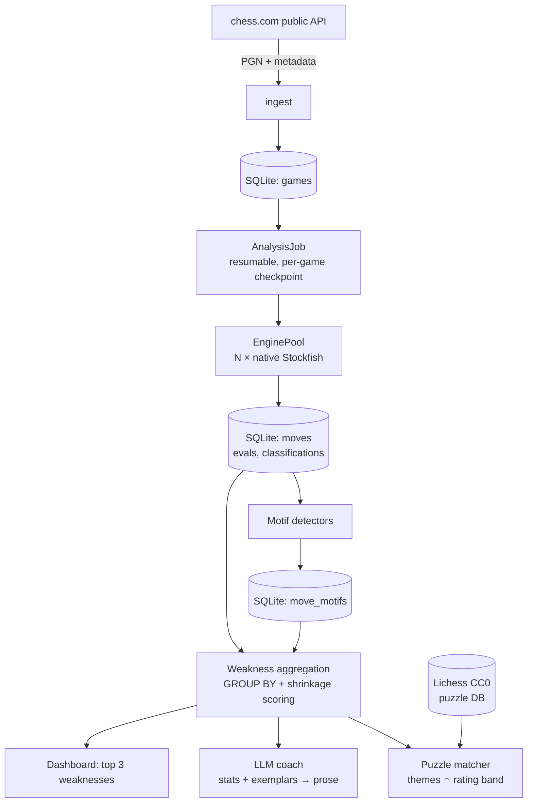

# chess-retro

Find the weaknesses you keep repeating — across hundreds of chess.com games, not just the last one.

Chess.com's Game Review and lichess's analysis both tell you what went wrong in **one game**. Neither
tells you what you keep getting wrong across your whole history. chess-retro downloads your games,
analyses every one with Stockfish, and aggregates across the entire corpus to rank your **recurring
weaknesses** — then prescribes puzzles targeting exactly those gaps.

It opens on "your top 3 weaknesses in blitz", not on a list of games.

Everything runs locally. Your games, your database, your machine.

## Status

Early development. Built as a sequence of vertical slices, each usable on its own:

| # | Slice | State |
|---|-------|-------|
| 01 | Scaffold, database, settings | ✅ done |
| 02 | Sync chess.com games into a browsable list | ✅ done |
| 03 | Label games with opening names | |
| 04 | Analyse one game and show its moves | ✅ done |
| 05 | Interactive board for a reviewed game | |
| 06 | Batch-analyse the whole corpus, resumably | |
| 07 | Tag moves with tactical motifs | |
| 08 | **Dashboard ranking your top weaknesses** | |
| 09 | Plain-English coaching on each weakness | |
| 10 | Puzzle practice matched to weaknesses | |
| 11 | Live engine analysis in the browser | |
| 12 | Incremental sync and release readiness | |

## Requirements

- **Node.js 22 or newer** (developed on 25)
- **Stockfish** — required to analyse games:
  ```sh
  brew install stockfish
  ```
  Set `STOCKFISH_PATH` if it is not on your `PATH`.

## Getting started

```sh
npm install
npm run dev
```

Open <http://localhost:3000>, go to **Settings**, and enter your chess.com username.

The database is created automatically at `data/chess-retro.db` on first run. It is a single SQLite
file — back it up by copying it, reset by deleting it.

## Commands

| Command | What it does |
|---------|--------------|
| `npm run dev` | Development server |
| `npm run build` | Production build |
| `npm start` | Production server (run this rather than deploying serverless — the engine pool lives in module scope) |
| `npm test` | Test suite |
| `npm run test:slow` | Tests that spawn a real Stockfish — run these whenever the engine layer changes |
| `npm run typecheck` | TypeScript, no emit |

## Configuration

| Variable | Default | Purpose |
|----------|---------|---------|
| `CHESS_RETRO_DB` | `data/chess-retro.db` | Database location |
| `STOCKFISH_PATH` | `stockfish` | Engine binary |

## How it works



Two design points worth knowing:

**The LLM explains; it does not discover.** Every statistic and every example position is computed by
deterministic code before the model is called. A `GROUP BY` over 40,000 positions is cheaper and more
reliable than a language model eyeballing the same data. The model's job is turning a true statistic
into an explanation you can act on.

**Time control is a filter, never an aggregation axis.** A blitz blunder and a rapid blunder are
different problems with different remedies. Averaging them describes a player who does not exist.

## Development notes

- **Database access** goes through `getDb()`, which memoises the connection on `globalThis` so dev-mode
  hot reload does not open a new handle per reload.
- **Schema** lives in two places that must be changed together: `src/db/schema.ts` (Drizzle, used for
  queries) and `src/db/migrate.ts` (DDL, applied on open). `schema.test.ts` asserts they agree.
- **Every game and move row carries `user`**, and `user` + `time_class` are denormalised onto move and
  motif rows. The first keeps two chess.com accounts from blending into one set of conclusions; the
  second avoids a join across tens of thousands of rows on every dashboard load.
- **Engine scores are normalised to the mover's perspective at write time.** UCI reports from the
  side-to-move's perspective, and that flips every ply, so `eval_after` is negated. This is the
  single easiest thing to get wrong, and it silently inverts every number downstream. Verified
  against the engine directly: one position reads `+720` with Black to move and `-761` with White.
- **`score mate 0` means the side to move is already checkmated** — the worst possible score, not
  the best. Reading it as a win inverts the cost of every checkmating move.
- **Classification keys on win-probability drop, never centipawns.** A 46cp drop in a `+612`
  position is "excellent"; a 300cp drop across the balance point is a blunder.
- **A game of P plies costs P+1 evaluations, not 2P.** Each position is evaluated once and a move's
  cost is the difference between consecutive evaluations.
- **The accuracy figures are checked against chess.com's**, which is the strongest validation
  available: across four real games ours differ by 1.9 points on average. A sudden divergence means
  a sign or perspective bug.
- **Tests are colocated** as `*.test.ts`. Files named `*.slow.test.ts` spawn a real Stockfish binary
  and are excluded from the default run.
- Vitest 5 prints an engine warning on odd-numbered Node releases such as 25. It runs correctly.

## Licence

GPL-3.0-or-later. See [LICENSE](LICENSE).

This is a deliberate choice, not an accident: Stockfish and chessground are both GPL, and no
permissively licensed chess engine exists. See [NOTICE](NOTICE) for dependency and data attributions.
