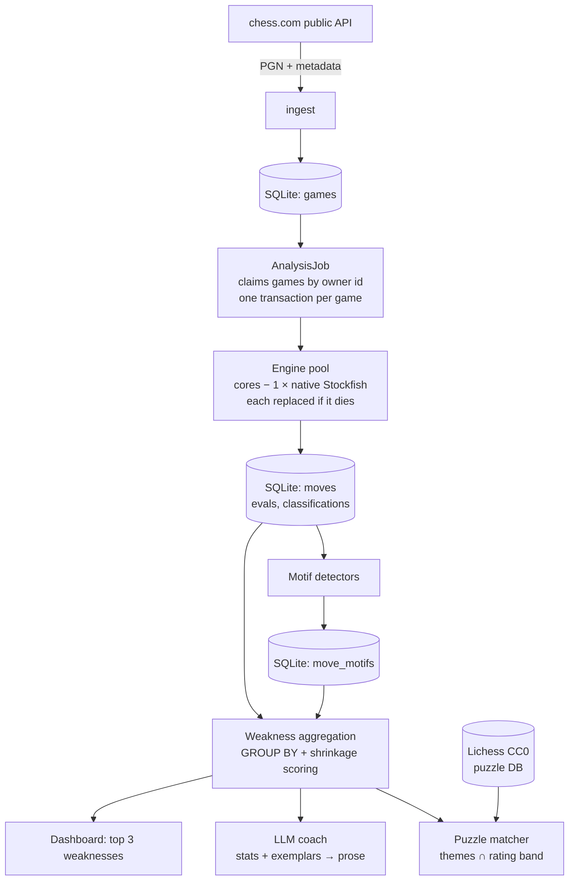
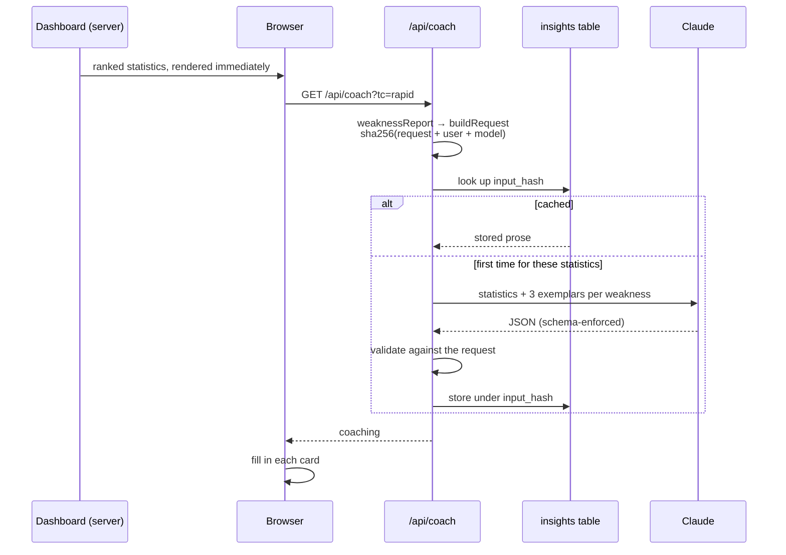

# chess-retro

Find the weaknesses you keep repeating — across hundreds of chess.com games, not just the last one.

Chess.com's Game Review and lichess's analysis both tell you what went wrong in **one game**. Neither
tells you what you keep getting wrong across your whole history. chess-retro downloads your games,
analyses every one with Stockfish, and aggregates across the entire corpus to rank your **recurring
weaknesses** — then prescribes puzzles targeting exactly those gaps.

It opens on "your top 3 weaknesses in blitz", not on a list of games.

Everything runs locally. Your games, your database, your machine.

## Status

Early development. Built as a sequence of vertical slices, each usable on its own:

| # | Slice | State |
|---|-------|-------|
| 01 | Scaffold, database, settings | ✅ done |
| 02 | Sync chess.com games into a browsable list | ✅ done |
| 03 | Label games with opening names | ✅ done |
| 04 | Analyse one game and show its moves | ✅ done |
| 05 | Interactive board for a reviewed game | ✅ done |
| 06 | Batch-analyse the whole corpus, resumably | ✅ done |
| 07 | Tag moves with tactical motifs | ✅ done |
| 08 | **Dashboard ranking your top weaknesses** | ✅ done |
| 09 | **Plain-English coaching on each weakness** | ✅ done |
| 10 | Puzzle practice matched to weaknesses | |
| 11 | Live engine analysis in the browser | |
| 12 | Incremental sync and release readiness | |

## Requirements

- **Node.js 22 or newer** (developed on 25)
- **Stockfish** — required to analyse games:
  ```sh
  brew install stockfish
  ```
  Set `STOCKFISH_PATH` if it is not on your `PATH`.

## Getting started

```sh
npm install
npm run dev
```

Open <http://localhost:3000>, go to **Settings**, and enter your chess.com username.

The database is created automatically at `data/chess-retro.db` on first run. It is a single SQLite
file — back it up by copying it, reset by deleting it.

## Commands

| Command | What it does |
|---------|--------------|
| `npm run dev` | Development server |
| `npm run build` | Production build |
| `npm start` | Production server (run this rather than deploying serverless — the engine pool lives in module scope) |
| `npm test` | Test suite |
| `npm run test:slow` | Tests that spawn a real Stockfish — run these whenever the engine layer changes |
| `npm run typecheck` | TypeScript, no emit |

## Configuration

| Variable | Default | Purpose |
|----------|---------|---------|
| `CHESS_RETRO_DB` | `data/chess-retro.db` | Database location |
| `STOCKFISH_PATH` | `stockfish` | Engine binary |
| `ANTHROPIC_API_KEY` | *(unset)* | Enables the coaching prose on the dashboard. Without it the dashboard still ranks and explains your weaknesses from the statistics — the core feature is not gated behind a paid account. Read server-side only; it never reaches the browser. |

## How it works



Two design points worth knowing:

**The LLM explains; it does not discover.** Every statistic and every example position is computed by
deterministic code before the model is called. A `GROUP BY` over 40,000 positions is cheaper and more
reliable than a language model eyeballing the same data. The model's job is turning a true statistic
into an explanation you can act on.

**Coaching is cached against its inputs.** The model is asked once per distinct set of statistics.
The cache key hashes three things: the request (corpus size, ranked weaknesses, and three example
positions each), the player it is about, and the model that wrote it — identical numbers belonging
to two accounts are not the same explanation, and an upgraded model must not keep serving the old
one's prose. Revisiting the dashboard is instant and costs nothing; analysing more games re-asks
only if the ranking actually moved.



**The model explains; it never discovers — and it is checked.** The instruction to stay inside the
data is necessary but not sufficient, because a model that knows chess can write a fluent paragraph
about a weakness this player was never measured for. Every returned weakness is matched back against
the request that produced it and dropped if unsupported. Practice themes pass two gates: the theme
must be a motif a detector can emit (so ticket 10 can look up puzzles by it) **and** one this player
was actually measured on — a correctly spelled `backRankMate` is still advice about chess in general
if their data never mentioned it. One invented claim costs that paragraph, not the page.

**Time control is a filter, never an aggregation axis.** A blitz blunder and a rapid blunder are
different problems with different remedies. Averaging them describes a player who does not exist.

## Development notes

- **Database access** goes through `getDb()`, which memoises the connection on `globalThis` so dev-mode
  hot reload does not open a new handle per reload.
- **Schema** lives in two places that must be changed together: `src/db/schema.ts` (Drizzle, used for
  queries) and `src/db/migrate.ts` (DDL, applied on open). `schema.test.ts` asserts they agree.
  Changing the shape of an existing table also needs a `SCHEMA_VERSION` bump and a step in
  `client.ts`, and the migration test asserts against `SCHEMA_VERSION` so only its column
  expectations need extending. Prefer `ALTER TABLE ADD COLUMN` over the drop-and-rebuild that version 2 used: an
  analysed corpus costs hours of engine time, and rebuilding throws it away.
- **Every game and move row carries `user`**, and `user` + `time_class` are denormalised onto move and
  motif rows. The first keeps two chess.com accounts from blending into one set of conclusions; the
  second avoids a join across tens of thousands of rows on every dashboard load.
- **Engine scores are normalised to the mover's perspective at write time.** UCI reports from the
  side-to-move's perspective, and that flips every ply, so `eval_after` is negated. This is the
  single easiest thing to get wrong, and it silently inverts every number downstream. Verified
  against the engine directly: one position reads `+720` with Black to move and `-761` with White.
- **`score mate 0` means the side to move is already checkmated** — the worst possible score, not
  the best. Reading it as a win inverts the cost of every checkmating move.
- **Classification keys on win-probability drop, never centipawns.** A 46cp drop in a `+612`
  position is "excellent"; a 300cp drop across the balance point is a blunder.
- **A game of P plies costs P+1 evaluations, not 2P.** Each position is evaluated once and a move's
  cost is the difference between consecutive evaluations.
- **The accuracy figures are checked against chess.com's**, which is the strongest validation
  available: across five real games ours differ by 1.7 points on average, worst 3.0. A sudden
  divergence means a sign or perspective bug.
- **The board is created once and updated in place.** chessground owns its own DOM and diffs
  internally, so `Board.tsx` mounts it in an effect with no dependencies and pushes changes through
  `api.set()`. Re-creating it per move flickers and throws away state every step.
- **Review logic is separated from rendering.** `review-model.ts` turns stored move rows into
  positions, arrows and graph points, and `eval-graph.ts` turns those into coordinates. Both are
  pure and directly tested; the components are wiring. Note SVG's y axis grows downward, so White
  being better must give a *smaller* y.
- **The unit of batch work is a whole game, not a position.** That keeps the engine's transposition
  table warm across the positions of one game, and makes resumability simple: a game is either
  entirely analysed or entirely not. Workers pull their next game from the database rather than
  from a list split up front, so an interrupted run loses only the games actually in flight.
- **`games.analysis_owner` says which run holds a game.** Orphan reclaim uses it to tell a crashed
  run's abandoned games from a live run's — without it, a reclaim during a batch would hand a game
  already being analysed to a second worker and one result would overwrite the other. The predicate
  is `and` over the live owners, never `or`: with two runs live, "not owned by A or not owned by B"
  is true of every game.
- **Pausing stops new games being taken; the ones in flight finish.** Anything that reuses or
  disposes a paused job's engines must `await job.settled()` first, or it writes to an engine
  mid-search and crosses two positions' results.
- **A tactic counts as *missed* only when passing it over actually cost win probability.**
  Without that floor every move the engine merely disagreed with is tagged: on the real corpus
  that put 27 "missed" tags on moves classified *excellent*, more than on mistakes and blunders
  combined. A tactic nobody lost anything by not playing is not a weakness.
- **Motif detectors are deliberately conservative**, and measured against the corpus rather than
  only against hand-built positions. A detector firing on ~9% of all moves is describing noise,
  not a tactic — that check caught `discoveredAttack` tagging almost every pawn push.
- **Escape squares must be read from a board with the check removed.** chess.js only yields
  check-evasions while a king is in check, so every other piece reports zero moves — which made
  any check that also attacked something look like a trapped piece.
- **Motif names are Lichess's exact theme strings**, so ticket 10 can match puzzles by direct
  lookup with no translation table. Display text lives in `motifs/labels.ts`, never in the data.
- **A game marked `error` leaves the corpus until something re-queues it.** `countPending` excludes
  failures deliberately, so one bad game cannot retry forever and stall an overnight run.
- **Positions are indexed by ply**: position 0 is the starting position, position N is the one
  reached after ply N. The board, the evaluation bar, the scoresheet and the graph all address
  positions by that single number — keeping them on one index is what stops the board showing one
  position while the evaluation beside it describes another.
- **Stored rows hold the position *before* each move**, so a game of P plies yields P positions and
  the final one has to be played out from the last row — otherwise the board can never show how the
  game actually ended.
- **Tests are colocated** as `*.test.ts`. Files named `*.slow.test.ts` spawn a real Stockfish binary
  and are excluded from the default run.
- Vitest 5 prints an engine warning on odd-numbered Node releases such as 25. It runs correctly.

## Licence

GPL-3.0-or-later. See [LICENSE](LICENSE).

This is a deliberate choice, not an accident: Stockfish and chessground are both GPL, and no
permissively licensed chess engine exists. See [NOTICE](NOTICE) for dependency and data attributions.
