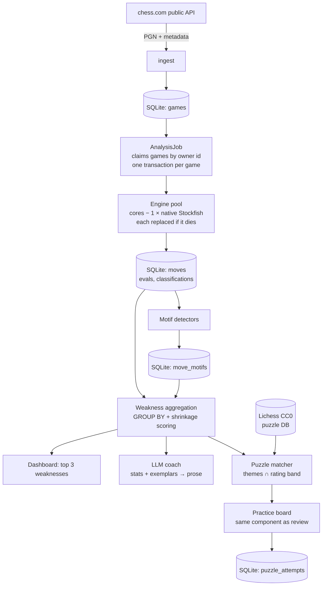
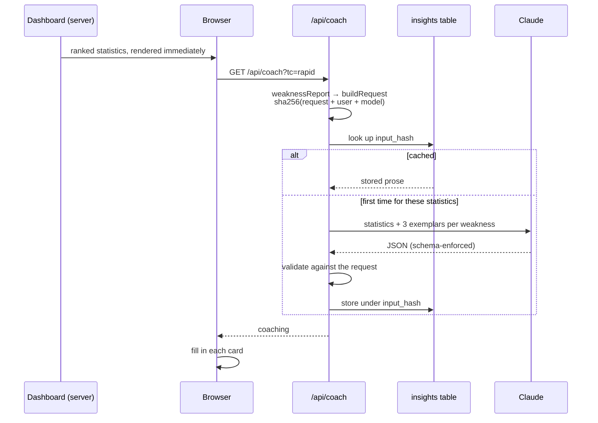
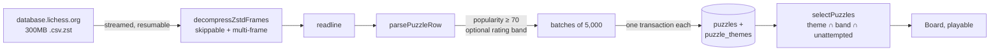
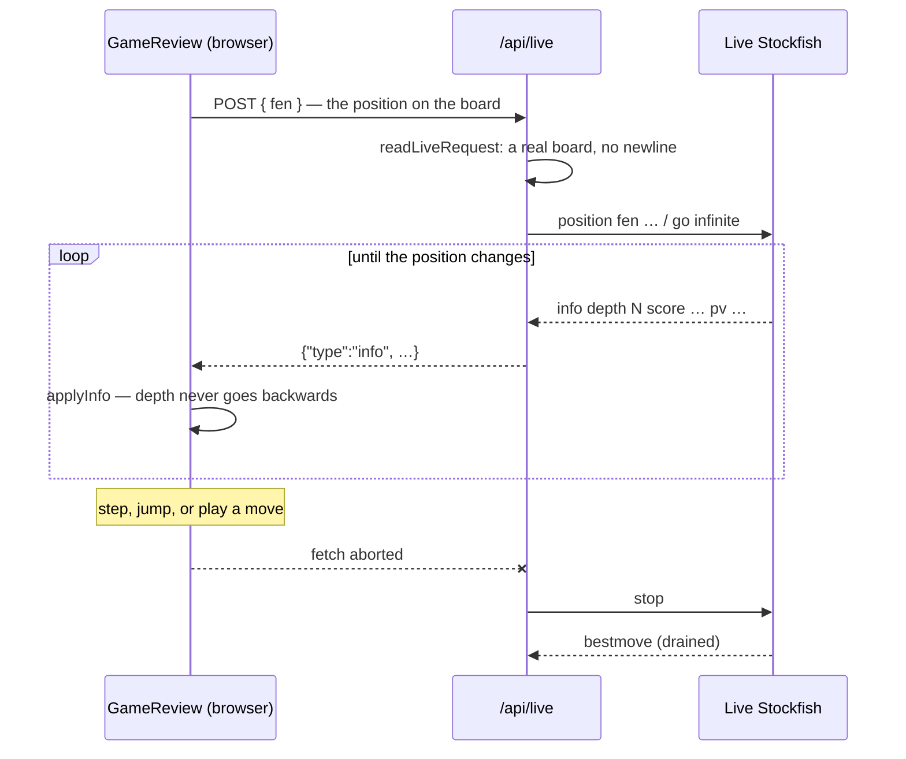

# chess-retro

Find the weaknesses you keep repeating — across hundreds of chess.com games, not just the last one.

Chess.com's Game Review and lichess's analysis both tell you what went wrong in **one game**. Neither
tells you what you keep getting wrong across your whole history. chess-retro downloads your games,
analyses every one with Stockfish, and aggregates across the entire corpus to rank your **recurring
weaknesses** — then prescribes puzzles targeting exactly those gaps.

It opens on "your top 3 weaknesses in blitz", not on a list of games.

Everything runs locally. Your games, your database, your machine.

## Status

Early development. Built as a sequence of vertical slices, each usable on its own:

| # | Slice | State |
|---|-------|-------|
| 01 | Scaffold, database, settings | ✅ done |
| 02 | Sync chess.com games into a browsable list | ✅ done |
| 03 | Label games with opening names | ✅ done |
| 04 | Analyse one game and show its moves | ✅ done |
| 05 | Interactive board for a reviewed game | ✅ done |
| 06 | Batch-analyse the whole corpus, resumably | ✅ done |
| 07 | Tag moves with tactical motifs | ✅ done |
| 08 | **Dashboard ranking your top weaknesses** | ✅ done |
| 09 | **Plain-English coaching on each weakness** | ✅ done |
| 10 | **Puzzle practice matched to weaknesses** | ✅ done |
| 11 | **Live engine analysis in the browser** | ✅ done |
| 12 | Incremental sync and release readiness | ✅ done |

## Requirements

| | | |
|---|---|---|
| **Node.js 22+** | required | developed on 25 |
| **Stockfish** | required | `brew install stockfish` — analysis cannot run without it |
| **A chess.com account** | required | only the public username; no password, no API key |
| **Anthropic API key** | optional | adds written coaching. Everything else works without it — see [Configuration](#configuration) |

Runs entirely on your machine. No account, no server, no data leaves the box — apart from fetching
your own games from chess.com's public API, and the coaching call if you enable it.

## Getting started

From a clean clone to your own dashboard. **Budget about an hour** to the dashboard, nearly all of it
step 4 running unattended — plus another ~15 minutes if you want the puzzle practice in step 6.

### 1. Install and start — under a minute

```sh
npm install
npm run dev
```

Open <http://localhost:3000>. The database is created for you at `data/chess-retro.db` on first run.

### 2. Install the engine — under a minute

```sh
brew install stockfish     # or your platform's package manager
```

Stockfish is not bundled: it is GPL, several tens of megabytes, and platform-specific. If it is not
on your `PATH`, set `STOCKFISH_PATH` to the binary. Nothing needs the engine until step 4, so the app
starts fine without it — analysis is what fails, with a message saying so.

### 3. Point it at your account — seconds

Go to **Settings**, enter your chess.com username, and choose how many games back to reach (the
default is 500). Then press **Sync games** on the Games page.

Downloading is fast — games arrive as PGN text, a few seconds per month of history. 500 games is
typically well under a minute.

### 4. Analyse the corpus — the long one

Press **Analyze all games**. This is the step that takes real time: every position of every game is
searched by Stockfish to depth 18.

| Corpus | Roughly |
|--------|---------|
| 100 games | ~10 minutes |
| 500 games (the default) | ~50 minutes |

Measured on a 10-core machine at 53s of engine time per game, spread across a pool of 9 engines —
one core is deliberately left free so the machine stays usable. A slower or smaller machine scales
about linearly with core count.

You do not have to sit through it. The run is **resumable**: progress, rate and an ETA are shown
live, **Pause** stops it taking new games, and pressing start again picks up where it left off. A
crash or a closed laptop loses at most the handful of games actually in flight.

### 5. Read your weaknesses — instant

The dashboard opens on your top 3 recurring weaknesses for a given time control, each with the
statistic behind it and links to the games where it happened. This is the point of the whole
exercise, and it is pure database work — no waiting.

### 6. Practise them — optional, ~15 minutes to set up

Each **tactical** weakness links through to puzzles for that theme. The first visit offers to
download the Lichess puzzle database: **~300MB, over ten minutes**, and the import itself a few
minutes more. The download resumes if the connection drops. Ticking *"only puzzles near my rating"*
stores a fraction of the file and loses nothing you would ever be served. Afterwards, practice works
with no network connection at all.

### Staying current afterwards

Press **Sync games** again whenever you like. It takes **seconds**, not another hour: months already
fetched in full are skipped without even a request, and only the current month — which is still
accumulating games — is re-checked. **Analyze all games** then analyses only what the sync brought
in; the corpus you already paid engine time for is never re-analysed.

Raising the corpus limit in Settings works the same way: the next sync backfills further into your
history, and only those older games are analysed.

The database is a single SQLite file — back it up by copying it, reset by deleting it.

## Commands

| Command | What it does |
|---------|--------------|
| `npm run dev` | Development server |
| `npm run build` | Production build |
| `npm start` | Production server (run this rather than deploying serverless — the engine pool lives in module scope) |
| `npm test` | Test suite |
| `npm run test:slow` | Tests that hit the network or spawn a real Stockfish — run these whenever the engine or the puzzle importer changes |
| `npm run typecheck` | TypeScript, no emit |

## Configuration

Everything below is optional. With none of it set, the app works: it finds Stockfish on your `PATH`,
keeps its database under `data/`, and runs every feature except the written coaching.

| Variable | Default | Purpose |
|----------|---------|---------|
| `CHESS_RETRO_DB` | `data/chess-retro.db` | Where the SQLite file lives. Point it elsewhere to keep several corpora side by side. |
| `STOCKFISH_PATH` | `stockfish` | The engine binary. Only needed when Stockfish is not on your `PATH`. |
| `ANTHROPIC_API_KEY` | *(unset)* | Enables the written coaching. Read server-side only; it never reaches the browser. |

Set them in a `.env.local` file at the repository root, or in the environment:

```sh
STOCKFISH_PATH=/opt/homebrew/bin/stockfish npm run dev
```

In-app settings — your chess.com username and how many games back to reach — live in the database,
not in the environment. Change them on the **Settings** page.

### Running without an API key

This is a supported way to use the app, not a degraded one. Without `ANTHROPIC_API_KEY`:

| Feature | Without a key |
|---------|---------------|
| Sync, analysis, opening labels | unaffected |
| Weakness ranking and the dashboard | unaffected — this is the core feature, and it is computed by SQL, not by a model |
| Every weakness's statistic and example games | unaffected |
| Puzzle practice | unaffected |
| Live engine analysis and board exploration | unaffected |
| Written coaching paragraphs | absent; the ranked weaknesses and their numbers are shown without the prose |

The ranking is deterministic code either way — the model only ever puts the statistics into words, so
what is lost is phrasing, never a finding. See *The LLM explains; it does not discover* below.

There is nothing to configure to opt out: leave the variable unset. If you set it later, coaching
appears on the next dashboard load, and the answers are cached against their inputs, so revisiting
costs nothing.

## How it works



Two design points worth knowing:

**The LLM explains; it does not discover.** Every statistic and every example position is computed by
deterministic code before the model is called. A `GROUP BY` over 40,000 positions is cheaper and more
reliable than a language model eyeballing the same data. The model's job is turning a true statistic
into an explanation you can act on.

**Coaching is cached against its inputs.** The model is asked once per distinct set of statistics.
The cache key hashes three things: the request (corpus size, ranked weaknesses, and three example
positions each), the player it is about, and the model that wrote it — identical numbers belonging
to two accounts are not the same explanation, and an upgraded model must not keep serving the old
one's prose. Revisiting the dashboard is instant and costs nothing; analysing more games re-asks
only if the ranking actually moved.



**The model explains; it never discovers — and it is checked.** The instruction to stay inside the
data is necessary but not sufficient, because a model that knows chess can write a fluent paragraph
about a weakness this player was never measured for. Every returned weakness is matched back against
the request that produced it and dropped if unsupported. Practice themes pass two gates: the theme
must be a motif a detector can emit (so ticket 10 can look up puzzles by it) **and** one this player
was actually measured on — a correctly spelled `backRankMate` is still advice about chess in general
if their data never mentioned it. One invented claim costs that paragraph, not the page.

**Time control is a filter, never an aggregation axis.** A blitz blunder and a rapid blunder are
different problems with different remedies. Averaging them describes a player who does not exist.

**Practice closes the loop.** A weakness that is a tactic links straight through to puzzles for that
theme, because motif names are Lichess's own theme strings and the match is a direct lookup. Puzzles
come from the Lichess database — public domain, downloaded once, then used entirely offline.



**Analysis is live, and the board is yours.** Stepping through a reviewed game shows the stored
verdict on the move that was played; switching the engine on shows what Stockfish thinks of the
position *now*, deepening as you watch. Any legal move can be played on the board to ask "what if I
had played this instead" — the engine follows you into the variation, and "Back to the game" returns.



**The engine is on the server, where the ticket asked for WebAssembly in a browser worker.** A
deliberate deviation, recorded because it is the kind that looks like an oversight: the native engine
is stronger, reuses the UCI layer the rest of the app already speaks, and adds no dependency or
cross-origin isolation headers. What it gives up is the isolation a worker gets for free — the live
engine is its own process and never queues behind batch work, but it competes for the same cores, so
live analysis is slower while a batch job runs. Moving to WASM would replace `engine/live.ts`, the
route and `analyseLive`; the exploration model, the display model and the UI are already independent
of where the engine lives.

`go infinite` stops for no timer, so the `AbortController` in the browser, the request's `abort` on
the server and the drained `bestmove` on the engine are one chain — break any link and Stockfish
keeps searching a position nobody is looking at. Two things besides the disconnect can end a search,
and both exist because that chain is the only thing holding a *shared* engine: a newer search
displaces an older one, and a ten-minute ceiling catches a disconnect that is never reported.

## Development notes

- **Database access** goes through `getDb()`, which memoises the connection on `globalThis` so dev-mode
  hot reload does not open a new handle per reload.
- **Schema** lives in two places that must be changed together: `src/db/schema.ts` (Drizzle, used for
  queries) and `src/db/migrate.ts` (DDL, applied on open). `schema.test.ts` asserts they agree.
  Changing the shape of an existing table also needs a `SCHEMA_VERSION` bump and a step in
  `client.ts`, and the migration test asserts against `SCHEMA_VERSION` so only its column
  expectations need extending. Prefer `ALTER TABLE ADD COLUMN` over the drop-and-rebuild that version 2 used: an
  analysed corpus costs hours of engine time, and rebuilding throws it away.
- **Every game and move row carries `user`**, and `user` + `time_class` are denormalised onto move and
  motif rows. The first keeps two chess.com accounts from blending into one set of conclusions; the
  second avoids a join across tens of thousands of rows on every dashboard load.
- **Engine scores are normalised to the mover's perspective at write time.** UCI reports from the
  side-to-move's perspective, and that flips every ply, so `eval_after` is negated. This is the
  single easiest thing to get wrong, and it silently inverts every number downstream. Verified
  against the engine directly: one position reads `+720` with Black to move and `-761` with White.
- **`score mate 0` means the side to move is already checkmated** — the worst possible score, not
  the best. Reading it as a win inverts the cost of every checkmating move.
- **Classification keys on win-probability drop, never centipawns.** A 46cp drop in a `+612`
  position is "excellent"; a 300cp drop across the balance point is a blunder.
- **A game of P plies costs P+1 evaluations, not 2P.** Each position is evaluated once and a move's
  cost is the difference between consecutive evaluations.
- **The accuracy figures are checked against chess.com's**, which is the strongest validation
  available: across five real games ours differ by 1.7 points on average, worst 3.0. A sudden
  divergence means a sign or perspective bug.
- **The board is created once and updated in place.** chessground owns its own DOM and diffs
  internally, so `Board.tsx` mounts it in an effect with no dependencies and pushes changes through
  `api.set()`. Re-creating it per move flickers and throws away state every step.
- **Review logic is separated from rendering.** `review-model.ts` turns stored move rows into
  positions, arrows and graph points, and `eval-graph.ts` turns those into coordinates. Both are
  pure and directly tested; the components are wiring. Note SVG's y axis grows downward, so White
  being better must give a *smaller* y.
- **The unit of batch work is a whole game, not a position.** That keeps the engine's transposition
  table warm across the positions of one game, and makes resumability simple: a game is either
  entirely analysed or entirely not. Workers pull their next game from the database rather than
  from a list split up front, so an interrupted run loses only the games actually in flight.
- **`games.analysis_owner` says which run holds a game.** Orphan reclaim uses it to tell a crashed
  run's abandoned games from a live run's — without it, a reclaim during a batch would hand a game
  already being analysed to a second worker and one result would overwrite the other. The predicate
  is `and` over the live owners, never `or`: with two runs live, "not owned by A or not owned by B"
  is true of every game.
- **Pausing stops new games being taken; the ones in flight finish.** Anything that reuses or
  disposes a paused job's engines must `await job.settled()` first, or it writes to an engine
  mid-search and crosses two positions' results.
- **A tactic counts as *missed* only when passing it over actually cost win probability.**
  Without that floor every move the engine merely disagreed with is tagged: on the real corpus
  that put 27 "missed" tags on moves classified *excellent*, more than on mistakes and blunders
  combined. A tactic nobody lost anything by not playing is not a weakness.
- **Motif detectors are deliberately conservative**, and measured against the corpus rather than
  only against hand-built positions. A detector firing on ~9% of all moves is describing noise,
  not a tactic — that check caught `discoveredAttack` tagging almost every pawn push.
- **Escape squares must be read from a board with the check removed.** chess.js only yields
  check-evasions while a king is in check, so every other piece reports zero moves — which made
  any check that also attacked something look like a trapped piece.
- **Motif names are Lichess's exact theme strings**, so ticket 10 can match puzzles by direct
  lookup with no translation table. Display text lives in `motifs/labels.ts`, never in the data.
- **A game marked `error` leaves the corpus until something re-queues it.** `countPending` excludes
  failures deliberately, so one bad game cannot retry forever and stall an overnight run.
- **Positions are indexed by ply**: position 0 is the starting position, position N is the one
  reached after ply N. The board, the evaluation bar, the scoresheet and the graph all address
  positions by that single number — keeping them on one index is what stops the board showing one
  position while the evaluation beside it describes another.
- **Stored rows hold the position *before* each move**, so a game of P plies yields P positions and
  the final one has to be played out from the last row — otherwise the board can never show how the
  game actually ended.
- **The Lichess puzzle file needs its own decompressor.** It is not one zstd stream: it is a sequence
  of frames, each preceded by a *skippable* frame, repeating every ~9MB across the whole 300MB.
  `node:zlib` mishandles both halves — it rejects a skippable frame outright ("Unknown frame
  descriptor"), and it stops after the FIRST compressed frame while reporting a clean end of stream.
  The second is the dangerous one: the import succeeds, logs nothing, and stores 181,225 rows of 6.1
  million. `src/puzzles/zstd.ts` splits the frames and decompresses them one at a time.
- **Frame boundaries come from `bytesWritten`, never from scanning for the magic bytes.** The magic
  sequence occurs inside compressed data often enough to matter: a scanning implementation split the
  first frame early and turned 800,455 rows into 164,238, silently. The decompressor stops at the end
  of a frame and reports exactly how many bytes it consumed, which is authoritative.
- **A frame's output is pushed through in chunks, not concatenated.** Each frame decompresses to
  ~30MB and `Buffer.concat` holds both the parts and the join; on the real file that peaked at 1.8GB
  for output that is read line by line anyway. Streaming it through costs ~600MB instead — one
  buffered compressed frame plus its decompressed chunks. RSS during an import swings much higher
  than that, to several GB: those are short-lived buffers V8 has not bothered to collect, and forcing
  a collection brings it back to ~600MB with a 5MB heap every time. It is GC lag, not a leak.
- **An incomplete frame is not retried on every chunk.** A frame is only complete once its last byte
  arrives and the only way to find out is to try, so a naive retry decompresses a 9MB frame from the
  top over a hundred times. Waiting for 512KB of new input between attempts took the 40MB sample from
  10.1s to 1.7s.
- **The puzzle download resumes.** It takes over ten minutes, and the first full run died with
  `ECONNRESET` at minute eleven. A dropped connection re-requests with a `Range` header from the byte
  it reached. Bytes are counted from the web stream's own reader rather than a Node wrapper — a
  wrapper reads ahead, so bytes buffered when the connection dropped would be counted as received and
  never yielded, and the resumed request would start past them.
- **Puzzles are filtered at import, not at selection.** Popularity below 70 is dropped on the way in,
  and the import can be restricted to a rating band. Storing six million rows to serve a few thousand
  is a footprint nobody needs.
- **Only a `motif` weakness can be practised.** The gate is `dimension === "motif"`, never a bare key
  lookup: a `phase` weakness has the key `opening` or `endgame`, and BOTH are real Lichess puzzle
  themes. Matching on the key alone would serve endgame puzzles for a weakness about how someone
  handles endgames — a different claim — and the page would look like it was working.
- **A chessground board must be created with the interactivity it will have.**
  `bindBoard` attaches the mousedown and touchstart listeners and returns early when `viewOnly` is
  set — and it runs only at construction. Turning `viewOnly` off later through `api.set()` changes the
  flag but cannot retroactively bind anything, so a board built view-only renders the position, shows
  its legal moves, and silently ignores every click. The whole practice feature was dead this way
  while all of its tests passed, because they cover the pure modules and never mount a board.
  `board-interactivity.test.ts` drives real chessground against jsdom to keep it caught.
- **The stored puzzle FEN is one move too early, always.** The position is the one before the
  opponent's setup move, so `movesUci[0]` must be applied before display. `openPuzzle` is the only
  place allowed to read the stored FEN, so no caller can forget.
- **The live search has its own engine process.** Not the `getEngine()` singleton: `analyse` calls are
  serialised per engine, so a live search opened while a game was being analysed would queue behind a
  search of every position in that game and the panel would sit blank for minutes with no clue why.
  Every engine holder must also be disposed in `instrumentation-node.ts` — the batch pool, the review
  singleton and the live one are three separate processes, and one left out is one leaked.
- **`go infinite` stops for nothing but `stop`.** There is no depth limit and no movetime on a live
  search, because it is being watched and an engine that halted at depth 18 looks broken. What ends it
  is the client disconnecting: the browser's `AbortController` closes the response body, the route's
  `request.signal` fires, and `analyseLive` sends `stop` and drains the `bestmove` it is still owed.
  Skip that drain and the NEXT search resolves on this one's reply — one position's evaluation
  reported under another's, silently. A ten-minute ceiling in the route is the backstop: the whole
  lifecycle otherwise rests on one abort signal, and a disconnect that is never reported would hold
  the shared engine for the life of the process.
- **A new live search displaces the one running, rather than queueing behind it.** They share the
  engine's queue with `analyse`, and a live search ends only when *its own* client goes away — so a
  second tab, or the same tab before its abort has landed, would otherwise wait for the first reader
  to close the page. The symptom is the worst kind: "Thinking…" forever, no error, nothing logged.
  The newest position asked about is the one someone is looking at, so it wins.
- **The client waits 150ms before asking.** Holding the right arrow through a sixty-move game changes
  the position sixty times; without the debounce that is sixty searches started and stopped, and the
  engine spends the run being interrupted rather than analysing anything.
- **Live depth never goes backwards.** Stockfish reports a lower depth mid-search often enough to
  matter, from a new iteration's first lines and from helper threads. Accepting those walks the
  evaluation back through numbers already superseded, so the panel flickers between two assessments
  while the engine is quite sure of one.
- **The FEN in a live request is validated, not escaped.** It becomes a `position fen …` line on the
  engine's stdin and UCI is a line protocol, so an embedded newline would end that command and make
  everything after it a command of the caller's choosing. No real position contains one, so it is
  refused outright — and the board is then parsed, because a string can pass the character check and
  still not be a position.
- **`setAutoShapes` replaces the whole set.** The stored best-move arrow and the live engine arrow
  have to be set in ONE call; drawing them in two effects leaves only whichever ran last. They are
  deliberately different colours because they answer different questions and can point different ways.
- **Making the review board playable is a construction-time decision.** It is the same `viewOnly`
  trap that shipped the practice feature dead — see the chessground note below. `review-board.test.ts`
  drives the real board with the review's own props so a regression is loud rather than silent.
- **A rejected move still has to resync the board.** chessground moves the piece on its own board
  *before* calling `after`, so a move the caller turns down leaves it on the square it was dropped on
  while every prop stays identical — and identical dependencies mean the update effect does not
  re-run, so nothing puts it back. `Board` counts moves played on it and depends on that count, so
  the resync happens whether or not the position moved on.
- **Off the game line, the live search drives the bar and the stored verdict withdraws.** Both the
  bar and the verdict describe the move played at that index, and neither is about an explored
  position — leaving the stored ones up is precisely "the board showing one position while the
  evaluation beside it describes another". But the bar is not simply dropped: the live search is
  analysing exactly what is displayed, so it takes over, and watching the bar move as you try a line
  is the point of trying it. It greys only until the first evaluation arrives. The verdict has no
  live equivalent and so disappears; the scoresheet cursor deliberately stays, marking where the
  line branched from.
- **The live score is converted to White's perspective before it reaches the bar.** UCI reports from
  the side to move, which flips every ply: a position where White is a queen up reads `+927` with
  White to move and `-897` with Black to move (verified against the engine directly). Fed to the bar
  raw, it would swing fully across the board on every move of an explored line. `whitePovLiveScore`
  is the live counterpart of `whitePovScore`, kept beside it so the two cannot drift.
- **`score mate 0` needs a sign the number cannot carry.** It means the side to move is already
  checkmated, and multiplying zero by the perspective sign leaves zero — while `winPct` reads any
  non-positive mate as a loss *for White*, so a mated Black would empty the bar instead of filling
  it. The mated side is the side to move, so the sign comes from that.
- **An exploration is a value, never a mutable board.** Every operation returns a new one. A `Chess`
  instance threaded through React state is shared by reference, so any re-render that replayed a move
  would apply it twice and the board and the engine would disagree about the position.
- **A complete archive month is never refetched; the current one always is.** `sync_state` records
  which months were taken in full, and those are skipped without a request — that is what makes a
  re-sync seconds rather than another backfill. The current month is exempt because it is still
  accumulating games, and a month cut short by the corpus limit is deliberately left incomplete, or
  raising the limit later could never reach the games left behind.
- **Past the corpus limit, sync still accepts games newer than everything held.** Otherwise a full
  corpus could never pick up the game you played this morning: the limit would stop the walk before
  reaching it, and dropping the newest game to keep an older one is backwards. The rule is suspended
  on an empty corpus, where every game is "newer than nothing" and would ignore the limit entirely.
- **Incremental analysis is a property of the claim, not a separate code path.** The batch job only
  ever claims games whose `analysis_status` is `pending`, so games the last run finished are invisible
  to it. Nothing has to remember what was analysed when. `incremental.test.ts` covers the seam
  between sync and analysis, which is where "seconds, not another overnight run" is actually won.
- **"Already up to date" is decided on `stored` alone.** The tempting reading — nothing stored but
  something skipped — breaks on exactly the case that matters: a current corpus fetches no month at
  all, so `stored` and `skipped` are both zero, and the fallback would report "Downloaded 0 new
  games" for the commonest sync there is. `sync-message.ts` holds the rule and is directly tested,
  and takes the count alone rather than the sync result — a parameter that is not there cannot be
  consulted by mistake.
- **Tests are colocated** as `*.test.ts`. Files named `*.slow.test.ts` spawn a real Stockfish binary
  and are excluded from the default run.
- Vitest 5 prints an engine warning on odd-numbered Node releases such as 25. It runs correctly.

## Licence

**GPL-3.0-or-later.** See [LICENSE](LICENSE) for the full text.

This is a deliberate choice rather than an accident of copy-and-paste. The engine and the board
library are both GPL, and no permissively licensed chess engine exists — so a chess analysis tool
worth using is a GPL work, and saying otherwise would be wrong rather than merely optimistic.

What the app is built from, in short — [NOTICE](NOTICE) carries the full attributions:

| Component | Licence | Role |
|-----------|---------|------|
| [Stockfish](https://stockfishchess.org/) | GPL-3.0-or-later | The analysis engine. Installed by you, not bundled here. |
| [chessground](https://github.com/lichess-org/chessground) | GPL-3.0-or-later | The board, and the "cburnett" piece artwork in its stylesheets. |
| [chess.js](https://github.com/jhlywa/chess.js) | BSD-2-Clause | Move generation, validation, PGN parsing. |
| [Lichess puzzle database](https://database.lichess.org/#puzzles) | CC0 1.0 (public domain) | ~6.1M rated, theme-tagged puzzles. Downloaded by you, not redistributed here. |
| [lichess-org/chess-openings](https://github.com/lichess-org/chess-openings) | CC0 1.0 (public domain) | ~3,800 named opening lines, redistributed unmodified in `src/ingest/openings-data/`. |
| Next.js, React, Drizzle, Vitest | MIT / Apache-2.0 | Framework and tooling. |

Both datasets are public domain and require no attribution. They are credited anyway, because
knowing where data came from is worth more than the obligation to say so.

Game data comes from chess.com's public read-only API, which needs no key and no authentication —
only a descriptive `User-Agent`, which the client sends.
